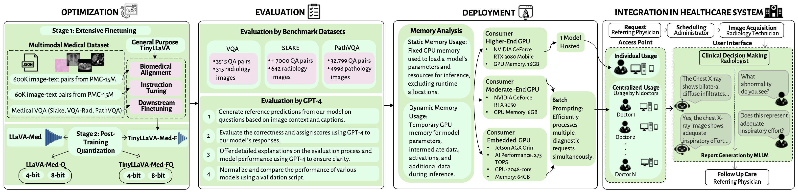

<h2 align="center"> <a href="https://openreview.net/pdf?id=2togYtQ7Ab">TinyLLaVA-Med-F</a><h5 align="center">


<p align="center">
     <br>
 
  <!-- *Overview of the methodology framework across four key stages for adapting MLLMs to resource-limited healthcare settings. Starting with the Optimization phase, the general-purpose TinyLLaVA model undergoes fine-tuning and quantization into variants TinyLLaVA-Med-F, FQ4, FQ8, while the quantization of LLaVA-Med leads to variants LLaVA-Med-Q4 and Q8. The Evaluation phase tests the models on benchmark datasets (VQA, SLAKE, PathVQA) and with GPT-4. In the Deployment stage, models are implemented on consumer devices to assess memory usage. Finally, the Integration into Hospital Systems stage explores their integration into healthcare systems for improved radiology services.* -->
</p>

## News 
- [2024.11] We presented our paper at IEEE-EMBS BHI in Houston, Texas.
- [2024.08] Our paper: [Advancing Healthcare in Low-Resource Environments
Through an Optimization and Deployment Framework for
Medical Multimodal Large Language Models
](https://openreview.net/pdf?id=2togYtQ7Ab) is accepted to IEEE-EMBS International Conference on Biomedical and Health Informatics (BHI). 
- [2024.06] Our [first initial paper](https://ieeexplore.ieee.org/abstract/document/10769172) is accepted to the 2024 IEEE International Conference on Image Processing (ICIP). 


## Table of Contents

- [Abstract](#Abstract)
- [Data Download](#data-download)
- [Requirements and Installation](#requirements-and-installation)
- [Model Download](#model-download)
- [Optimization](#optimization)
- [Demo](#demo)
- [Evaluation](#evaluation)
- [Memory Analysis](#memory-analysis)

## Abstract

The critical shortage of medical professionals in low-resource countries, notably in Africa, hinders adequate health-care delivery. AI, particularly Multimodal Large Language Models (MLLMs), can enhance the efficiency of healthcare systems by assisting in medical image analysis and diagnosis. However, the deployment of state-of-the-art MLLMs is limited in these regions due to the high computational demands that exceed the capabilities of consumer-grade GPUs. This paper presents a framework for optimizing MLLMs for resource-constrained environments. We introduce optimized medical MLLMs, including TinyLLaVA- Med-F, a medical fine-tuned MLLM, and quantized variants (TinyLLaVA-Med-FQ4, TinyLLaVA-Med-FQ8, LLaVA-Med-Q4, and LLaVA-Med-Q8) that demonstrate substantial reductions in memory usage without significant loss in accuracy. Specifically, TinyLLaVA-Med-FQ4 achieves the greatest reductions, lowering dynamic memory by approximately 89% and static memory by 90% compared to LLaVA-Med. Similarly, LLaVA-Med-Q4 reduces dynamic memory by 65% and static memory by 67% compared to state-of-the-art LLaVA-Med. These memory reductions make these models feasible for deployment on consumer-grade GPUs such as RTX 3050. This research underscores the potential for deploying optimized MLLMs in low-resource settings, providing a foundation for future developments in accessible AI-driven healthcare solutions.

## Data Download 

| Alignment data files                                                                                                            |       Size |
| ------------------------------------------------------------------------------------------------------------------------------- | ---------: |
| [llava_med_alignment_500k.json](https://hanoverprod.z21.web.core.windows.net/med_llava/alignment/llava_med_alignment_500k.json) | 341.52 MiB |

| Instruction-Tuning data files                                                                                                                            |       Size |
| -------------------------------------------------------------------------------------------------------------------------------------------------------- | ---------: |
| [llava_med_instruct_10k.json](https://hanoverprod.z21.web.core.windows.net/med_llava/instruct/llava_med_instruct_10k.json)                               |  19.24 MiB |
| [llava_med_instruct_60k.json](https://hanoverprod.z21.web.core.windows.net/med_llava/instruct/llava_med_instruct_60k.json)                               |  84.65 MiB |
| [llava_med_instruct_60k_inline_mention.json](https://hanoverprod.z21.web.core.windows.net/med_llava/instruct/llava_med_instruct_60k_inline_mention.json) |  83.61 MiB |
| [llava_med_instruct_fig_captions.json](https://hanoverprod.z21.web.core.windows.net/med_llava/instruct/llava_med_instruct_fig_captions.json)             | 161.39 MiB |

| Evaluation data files                                                                                                                                                                               |       Size |
| ---------------------------------------------------------------------------------------------------------------------------------------------------------------------------------------------- | ---------: |
| [llava_med_eval_qa50_qa.jsonl](https://hanoverprod.z21.web.core.windows.net/med_llava/eval/llava_med_eval_qa50_qa.jsonl)                                                                       | 256.18 KiB |
| [llava_med_eval_qa50_fig_captions.json](https://hanoverprod.z21.web.core.windows.net/med_llava/eval/llava_med_eval_qa50_fig_captions.json)                                                     |  51.82 KiB |
| [llava_med_qa50_instruct_caption_in_text_cleaned-60k-3epoch.json](https://hanoverprod.z21.web.core.windows.net/med_llava/eval/llava_med_qa50_instruct_caption_in_text_cleaned-60k-3epoch.json) | 100.97 KiB |

| Image URLS                                                                                                      |       Size |
| --------------------------------------------------------------------------------------------------------------- | ---------: |
| [llava_med_image_urls.jsonl](https://hanoverprod.z21.web.core.windows.net/med_llava/llava_med_image_urls.jsonl) | 122.82 MiB |

[download_images.py](llava/data/download_images.py) is used to download the PMC articles using the above image_urls file and extract the images.

| Medical VQA data files                                                                                   |       Size |
| -------------------------------------------------------------------------------------------------------- | ---------: |
| [VQA Images](https://drive.google.com/file/d/1l9hnxa2Y3D8rhNLldtCQ0vGPhsiWH_Su/view)                     | 987 MiB    |
| [Train_all.json](https://drive.google.com/file/d/1mf3lyW7CbfCowGC58gXsam-3dPwIenbJ/view?usp=sharing)   | 10.3 MiB    |
| [Test.json](https://drive.google.com/file/d/1pyGsm8G0Gig63DAnOdLuUn3IyxrztWtR/view?usp=sharing)          | 96 KiB    |


To download our language-image multimodal instruction-following dataset, please run the following script:

```bash
sh download_data.sh
```

## Requirements and Installation

To get started, please follow these installation instructions:

1. Clone this repository and navigate to TinyLLaVA-Med-F folder

```bash
cd TinyLLaVA-Med-F
```

2. Install Package

```Shell
conda create -n tinyllava-med-f python=3.10 -y
conda activate tinyllava-med-f
pip install --upgrade pip  # enable PEP 660 support
pip install -e .
```

3. Install additional packages for training cases

```Shell
pip install -e ".[train]"
pip install flash-attn --no-build-isolation
```

### Upgrade to the latest code base

```Shell
git pull
pip install -e .
```

## Model Download
| Model Descriptions | 🤗 Huggingface Hub                           |
| ------------------ | -------------------------------------------- |
| TinyLLaVA-Med-F     | [TinyLLaVA-Med-F/TinyLLaVA-Med-F](https://huggingface.co/TinyLLaVA-Med-F/TinyLLaVA-Med-F) |


<!-- ### 8-bit Quantized Variants
#### TinyLLaVA-Med-FQ4
#### LLaVA-Med-Q4

### 4-bit Quantized Variants
#### TinyLLaVA-Med-FQ8 

#### LLaVA-Med-Q8


### Pretrained Models
 -->


## Optimization

### Stage 1: Extensive Finetuning

<details>
<summary> Biomedical Alignment </summary>

```Shell
DATA_PATH= /path/to/llava_med_alignment_500k.json \
IMAGE_PATH= /path/to/your-image-folder

LLM_VERSION=bczhou/TinyLLaVA-1.5B
VT_VERSION=bczhou/TinyLLaVA-1.5B-SigLIP

output_directory= /path/to/biomedical-alignment/checkpoints
wandb_path= Tinyllava_biomedical-alignment

deepspeed tinyllava/train/train.py \
    --deepspeed ./scripts/tiny_llava/zero3.json \
    --model_name_or_path $LLM_VERSION \
    --version v1 \
    --data_path  $DATA_PATH\
    --image_folder $IMAGE_PATH \
    --vision_tower $VT_VERSION \
    --mm_projector_type mlp2x_gelu \
    --mm_vision_select_layer -2 \
    --mm_use_im_start_end False \
    --mm_use_im_patch_token False \
    --tune_mm_mlp_adapter True \
    --tune_entire_model True \
    --bf16 True \
    --output_dir $output_directory \
    --num_train_epochs 1 \
    --per_device_train_batch_size 32 \
    --per_device_eval_batch_size 4 \
    --gradient_accumulation_steps 2 \
    --evaluation_strategy "no" \
    --save_strategy "epoch" \
    --learning_rate 2e-5 \
    --weight_decay 0. \
    --warmup_ratio 0.03 \
    --lr_scheduler_type "cosine" \
    --logging_steps 1 \
    --tf32 False \
    --model_max_length 2048 \
    --gradient_checkpointing True \
    --dataloader_num_workers 15 \
    --lazy_preprocess True \
    --report_to wandb \
    --run_name $wandb_path
```

</details>

<details>
<summary> Instruction Tuning </summary>


```Shell
DATA_PATH= /path/to/llava_med_instruct_60k_inline_mention.jsonl \
IMAGE_PATH= /path/to/your-image-folder

LLM_VERSION= /path/to/biomedical-alignment/checkpoints
VT_VERSION=bczhou/TinyLLaVA-1.5B-SigLIP

output_directory= /path/to/instruction-tuning/checkpoints
wandb_path= Tinyllava_instruction-tuning

deepspeed tinyllava/train/train.py \
    --deepspeed ./scripts/tiny_llava/zero3.json \
    --model_name_or_path $LLM_VERSION \
    --version v1 \
    --data_path  $DATA_PATH\
    --image_folder $IMAGE_PATH \
    --vision_tower $VT_VERSION \
    --mm_projector_type mlp2x_gelu \
    --mm_vision_select_layer -2 \
    --mm_use_im_start_end False \
    --mm_use_im_patch_token False \
    --tune_mm_mlp_adapter True \
    --tune_entire_model True \
    --bf16 True \
    --output_dir $output_directory \
    --num_train_epochs 10 \
    --per_device_train_batch_size 32 \
    --per_device_eval_batch_size 4 \
    --gradient_accumulation_steps 2 \
    --evaluation_strategy "no" \
    --save_strategy "epoch" \
    --learning_rate 2e-5 \
    --weight_decay 0. \
    --warmup_ratio 0.03 \
    --lr_scheduler_type "cosine" \
    --logging_steps 1 \
    --tf32 False \
    --model_max_length 2048 \
    --gradient_checkpointing True \
    --dataloader_num_workers 15 \
    --lazy_preprocess True \
    --report_to wandb \
    --run_name $wandb_path
```

</details>


<details>
<summary>Downstream Finetuning </summary>

```Shell
LLM_VERSION=/path/to/instruction-tuning/checkpoints
VT_VERSION=bczhou/TinyLLaVA-1.5B-SigLIP


DATA_PATH=/path/to/3vqa/train_all.json
IMAGE_PATH=/path/to/3vqa/images

output_directory=/path/to/downstream-finetuning/checkpoints 
wandb_path=Tinyllava_downstream-finetuning

deepspeed tinyllava/train/train.py \
    --deepspeed ./scripts/tiny_llava/zero3.json \
    --model_name_or_path $LLM_VERSION \
    --version v1 \
    --data_path  $DATA_PATH\
    --image_folder $IMAGE_PATH \
    --vision_tower $VT_VERSION \
    --mm_projector_type mlp2x_gelu \
    --mm_vision_select_layer -2 \
    --mm_use_im_start_end False \
    --mm_use_im_patch_token False \
    --tune_mm_mlp_adapter True \
    --tune_entire_model True \
    --bf16 True \
    --output_dir $output_directory \
    --num_train_epochs 18 \
    --per_device_train_batch_size 32 \
    --per_device_eval_batch_size 4 \
    --gradient_accumulation_steps 2 \
    --evaluation_strategy "no" \
    --save_strategy "epoch" \
    --learning_rate 2e-5 \
    --weight_decay 0. \
    --warmup_ratio 0.03 \
    --lr_scheduler_type "cosine" \
    --logging_steps 1 \
    --tf32 False \
    --model_max_length 2048 \
    --gradient_checkpointing True \
    --dataloader_num_workers 15 \
    --lazy_preprocess True \
    --report_to wandb \
    --run_name $wandb_path
```

</details>


### Stage 2: Post-training Quantization

When running inference, you can choose between different quantization settings to optimize memory usage:

- Use --load_4bit to load the model in 4-bit quantized mode.
- Use --load_8bit to load the model in 8-bit quantized mode.

If neither flag is specified, the model will load in full precision (FP16 or FP32 depending on your setup).
This allows flexibility depending on your hardware constraints.

```Shell
python tinyllava/eval/model_vqa_science.py \
    --model-name /path/to/downstream-finetuning/checkpoints \
    --question-file path/to/eval/vqa_rad/test.json \
    --image-folder path/to/eval/vqa_rad/images \
    --answers-file /path/to/eval/vqa_test-answer-file.jsonl \
    --load_4bit
```
Replace --load_4bit with --load_8bit to enable 8-bit quantization instead. If neither flag is provided, the model will run in full precision.

## Demo

Launch a local Gradio Web Demo by running:

```shell
python tinyllava/serve/app.py --model-path TinyLLaVA-Med-F/TinyLLaVA-Med-F
```


## Evaluation

### 1. Evaluation by Benchmark Datasets (SLAKE, VQA-RAD, PathVQA)

Three Medical VQA datasets are considered in our experiments, including VQA-Rad, SLAKE, and Pathology-VQA. We use VQA-Rad as the running example to illustrate how TinyLLaVA-Med-F is applied to a downstream scenario.

#### - Download Medical VQA Data

1. Download the VQA images from  [Google Drive](https://drive.google.com/file/d/1l9hnxa2Y3D8rhNLldtCQ0vGPhsiWH_Su/view) for setting up the dataset.
2. Download Train_all.json for all VQA datasets from  [Google Drive](https://drive.google.com/file/d/1mf3lyW7CbfCowGC58gXsam-3dPwIenbJ/view?usp=sharing).
3. Download Test.json for each VQA dataset from  [Google Drive](https://drive.google.com/file/d/1pyGsm8G0Gig63DAnOdLuUn3IyxrztWtR/view?usp=sharing).


(a) Generate TinyLLaVA-Med responses on the ScienceQA dataset

```Shell
python tinyllava/eval/model_vqa_science.py \ 
    --model-name /path/to/downstream-finetuning/checkpoints  \
    --question-file path/to/eval/vqa_rad/test.json \
    --image-folder path/to/eval/vqa_rad/images \
    --answers-file /path/to/eval/vqa_test-answer-file.jsonl
```

(b) Evaluate the generated responses

```Shell
python tinyllava/eval/run_eval.py \
    --gt /path/to/eval/vqa_rad/test.json \
    --pred /path/to/eval/vqa_test-answer-file.jsonl
```


### 2. Evaluation by GPT-4 
In this evaluation, llava_med_eval_qa50_qa.jsonl contains the questions, context (captions and inline-mentions), and responses generated by text-only GPT-4, which we treat as ground truth.

(a) Generate Answer using TinyLLaVA-Med-F

```Shell
python tinyllava/eval/model_vqa_gpt4.py \
    --model-path /path/to/instruction-tuning/checkpoints \
    --question-file /path/to/llava_med_eval_qa50_qa.jsonl \
    --image-folder /path/to/your-LLaVa-Med-image-folder \
    --answers-file  /path/to/your-answer-file-GPt_evaluation.jsonl \
    --temperature 0.0
```


(b) GPT-4 Evaluation of the Generated Answers
```Shell
python tinyllava/eval/eval_multimodal_chat_gpt_score.py \
    --answers-file /path/to/your-answer-file-GPt_evaluation.jsonl \
    --question-file /path/to/llava_med_eval_qa50_qa.jsonl \
    --scores-file  /path/to/score-file-GPt_evaluation.jsonl 
```

(c) Summarize the Evaluation Results
```Shell
python tinyllava/eval/summarize_gpt_review_gpt4.py 
    --scores-file /path/to/score-file-GPt_evaluation.jsonl 
```


## Memory Analysis
You can run inference while also logging detailed hardware performance metrics, including:

- Inference time per question
- Tokens generated per second
- Peak GPU memory usage per question
- Overall model memory footprint

These metrics are automatically printed to the console and saved in the output file during evaluation.


```Shell
python tinyllava/eval/model_vqa_hardware.py \
  --model-name /path/to/downstream-finetuning/checkpoints \
  --question-file path/to/eval/vqa_rad/test.json \
  --image-folder path/to/eval/vqa_rad/images \
  --answers-file /path/to/eval/vqa_test-answer-file.jsonl \
  --load_4bit
```

Replace --load_4bit with --load_8bit to enable 8-bit quantization instead. If neither flag is provided, the model will run in full precision.

The resulting answers file will include each model prediction along with the corresponding metrics in the metadata field.

## Acknowledgement
Special thanks to the following for providing us with the codebase, base models, and dataset with the amazing multimodal and language capabilities: 
- [LLaVA-Med](https://github.com/microsoft/LLaVA-Med) 
- [TinyLLaVA_Factory](https://github.com/TinyLLaVA/TinyLLaVA_Factory)
- [Med-MoE](https://github.com/jiangsongtao/Med-MoE)
